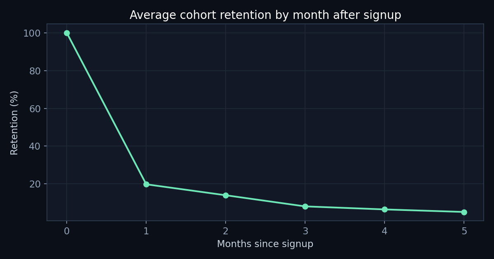
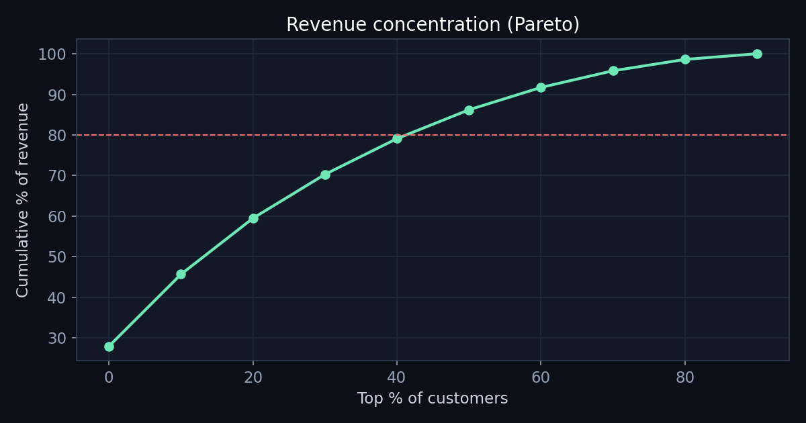

# Where is our growth budget actually leaking?

**A SQL-driven analysis of customer quality by acquisition channel — and what it means for where the next marketing dollar should go.**

> TL;DR — Discount-acquired customers have the lowest CAC, so they *look* like the most efficient channel. But over their first 90 days they generate **$142 vs $255–265** for organically/referral-acquired customers (**~45% less**) and repeat at **35% vs 44%**. We are optimising acquisition on the wrong metric. Judging channels on **90-day contribution instead of CAC** points to reallocating discount spend toward referral — a conservatively estimated **~$64K incremental 90-day revenue** at current per-customer values.

---

## 1. The business question

Marketing reports CAC by channel, and the Discount channel (first-order promo) has the lowest CAC — so it keeps getting more budget. But CAC says nothing about what a customer is *worth* after they arrive. The question:

> **Is our cheapest-to-acquire channel actually our most profitable one — or are we buying low-quality customers that churn before they pay us back?**

## 2. Data

Synthetic but realistically-structured ecommerce dataset (reproducible, seed=42):

| Table | Rows | Grain |
|---|---|---|
| `customers` | 6,000 | one row per customer (acquisition channel, signup, country) |
| `orders` | 10,937 | one row per order |
| `order_items` | 23,096 | one row per line item |

Generator: [`scripts/generate_data.py`](scripts/generate_data.py). Schema and all queries are in [`sql/`](sql/).

## 3. Method

Four analyses, each in its own SQL file (window functions, CTEs, `NTILE`, date math — all in SQLite):

1. **Channel quality** — average revenue in each customer's **first 90 days** (an equal-length window for every cohort, so late signups aren't penalised). [`sql/01_channel_quality.sql`](sql/01_channel_quality.sql)
2. **Cohort retention** — % of each monthly signup cohort still ordering N months later. [`sql/02_cohort_retention.sql`](sql/02_cohort_retention.sql)
3. **RFM segmentation** — Recency/Frequency/Monetary scored 1–4 via `NTILE`, bucketed into actionable segments. [`sql/03_rfm_segmentation.sql`](sql/03_rfm_segmentation.sql)
4. **Revenue concentration (Pareto)** — cumulative revenue share by customer decile. [`sql/04_revenue_concentration.sql`](sql/04_revenue_concentration.sql)

## 4. Findings

### Finding 1 — The cheapest channel is the worst channel (the headline)


| Channel | Customers | Avg 90-day revenue | Repeat rate |
|---|--:|--:|--:|
| Referral | 580 | **$265** | 44.0% |
| Organic | 1,831 | $255 | 44.5% |
| Paid Search | 1,315 | $228 | 45.4% |
| Paid Social | 1,236 | $208 | 43.9% |
| **Discount** | 1,038 | **$142** | **34.9%** |

Discount customers are worth **45% less** in their first 90 days and are **~10 points less likely to ever come back**. The low CAC is real — but so is the low value, and value is the half of the equation the CAC report never shows. **Channel efficiency should be measured as 90-day contribution per acquisition dollar, not CAC alone.**

### Finding 2 — Retention is decided in the first 30 days



Across cohorts, retention drops from 100% to **~18–20% by month 1** and flattens near 5–7% thereafter. The first-month experience is where lifetime value is won or lost — not later "win-back" campaigns aimed at the flat tail.

### Finding 3 — Revenue is highly concentrated



The **top 20% of customers drive ~60% of revenue; the top 40% drive ~79%** — a textbook Pareto curve. Combined with RFM, **"Champions" (26% of customers) generate 48% of all revenue.** Retention and VIP treatment of this segment is worth more than equivalent effort spread across the base.

## 5. Recommendation

1. **Stop scoring acquisition channels on CAC. Score them on 90-day contribution.** Re-rank the channel mix on the value column above; Discount falls from "best" to "worst."
2. **Reallocate Discount acquisition budget toward Referral.** Referral is the single highest-value channel and is under-scaled (580 customers). Stand up / fund a referral program to grow it.
3. **Move retention spend earlier.** Invest the first-30-day onboarding (the cliff in Finding 2), not the flat tail.
4. **Protect Champions.** A retention/VIP motion on the top RFM segment defends ~half of revenue.

### Quantified impact (conservative, stated assumptions)

If **half** of the Discount channel's volume (~519 customers/period) were instead acquired at Referral-grade value:

```
519 customers × ($265 − $142) ≈ $64K incremental 90-day revenue
≈ ~$255K annualised run-rate
```

**Assumptions / caveats:** this holds per-customer 90-day value constant and assumes Referral can absorb redirected volume — both should be validated with a **holdout test** before full reallocation. The dataset has no ad-spend, so this is framed in revenue, not margin; with CAC by channel the same query yields contribution-per-dollar directly. Synthetic data demonstrates the method — on production data the structure of the analysis is identical.

## 6. Reproduce

```bash
python3 scripts/generate_data.py   # builds data/ecommerce.db
python3 scripts/run_analysis.py    # runs all SQL, prints tables, renders charts/
```
