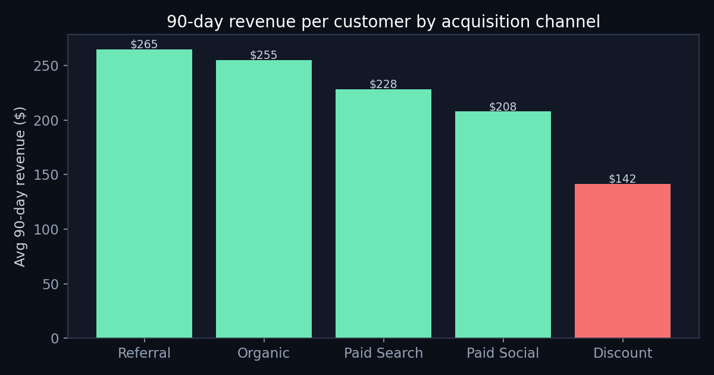

# Ecommerce Revenue Analysis — channel quality, retention & RFM

A SQL-first analysis answering a real operator question: **is our cheapest acquisition channel actually our most profitable one?** (Spoiler: no.)

**→ Read the full writeup: [ANALYSIS.md](ANALYSIS.md)**
**→ Business-analysis case (BABOK-structured): [BUSINESS-ANALYSIS.md](BUSINESS-ANALYSIS.md)** · [Elicitation plan](ELICITATION-PLAN.md)



## Headline finding

Discount-acquired customers have the lowest CAC but generate **~45% less 90-day revenue** ($142 vs $255–265) and churn harder (35% vs 44% repeat). Scoring channels on CAC instead of 90-day contribution hides this. Reallocating discount spend toward referral is worth a conservatively-estimated **~$64K incremental 90-day revenue**.

## What's in here

| | |
|---|---|
| [`sql/01_channel_quality.sql`](sql/01_channel_quality.sql) | 90-day value per customer by channel (window fns) |
| [`sql/02_cohort_retention.sql`](sql/02_cohort_retention.sql) | Monthly cohort retention triangle (date math) |
| [`sql/03_rfm_segmentation.sql`](sql/03_rfm_segmentation.sql) | RFM scoring via `NTILE`, actionable segments |
| [`sql/04_revenue_concentration.sql`](sql/04_revenue_concentration.sql) | Pareto revenue concentration (running window) |
| [`scripts/generate_data.py`](scripts/generate_data.py) | Reproducible synthetic dataset (seed=42) |
| [`scripts/run_analysis.py`](scripts/run_analysis.py) | Runs all queries, renders charts |

## Stack

SQLite · SQL (window functions, CTEs, NTILE) · Python (pandas, matplotlib)

## Reproduce

```bash
pip install pandas matplotlib
python3 scripts/generate_data.py
python3 scripts/run_analysis.py
```

## License

MIT © Brian Rodriguez
